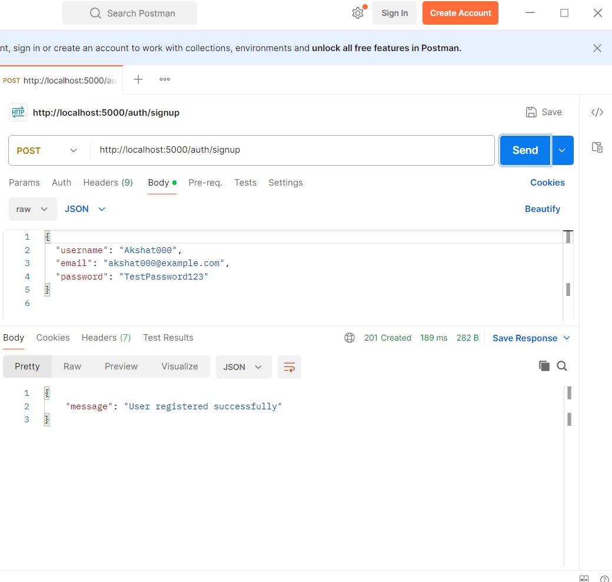
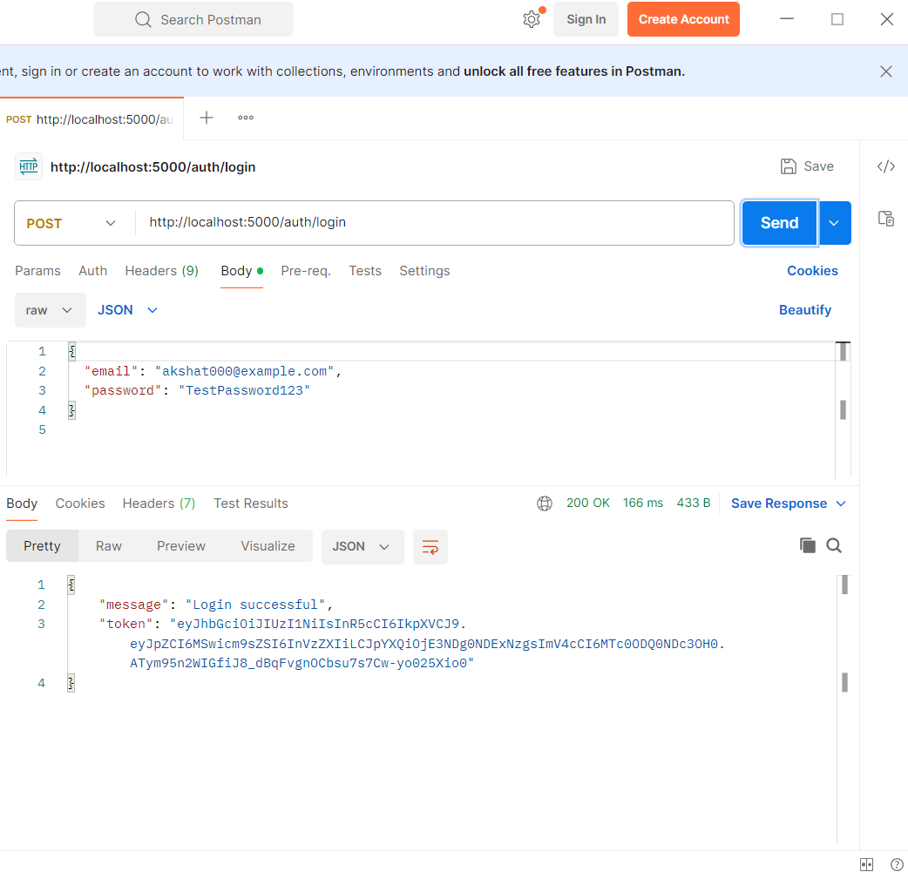
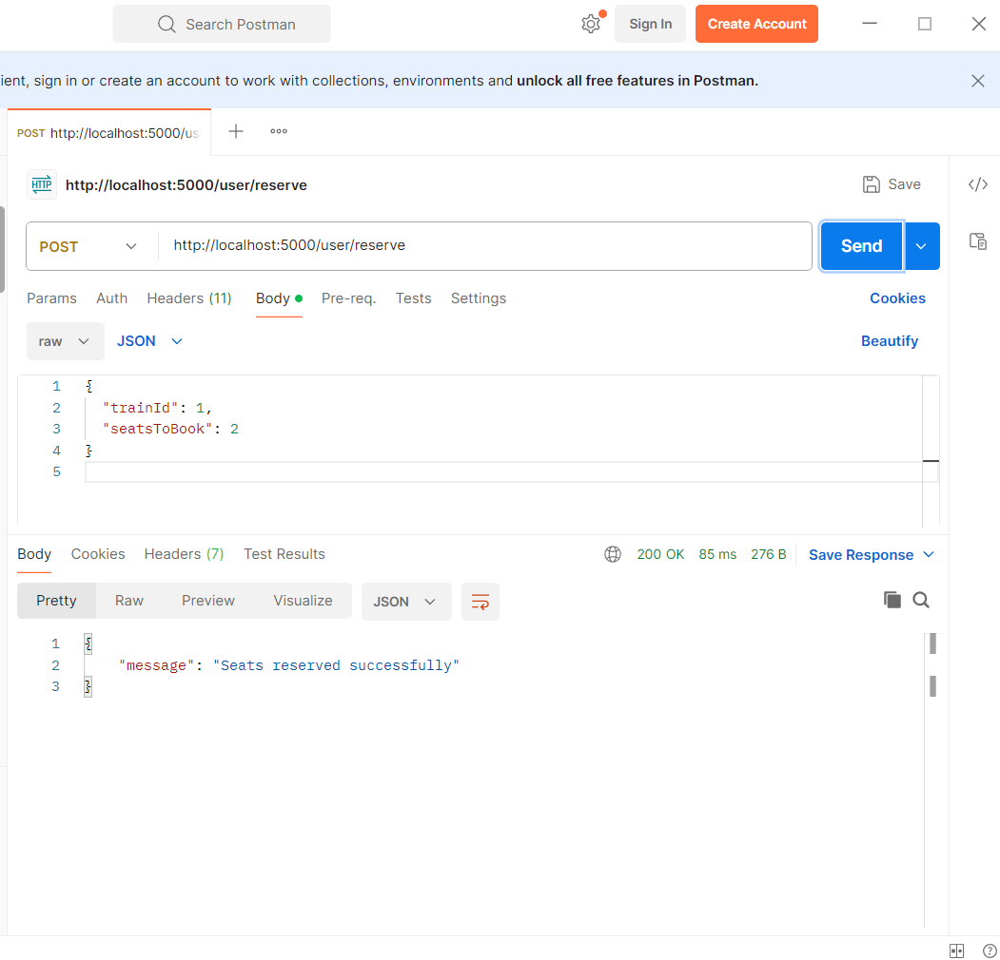
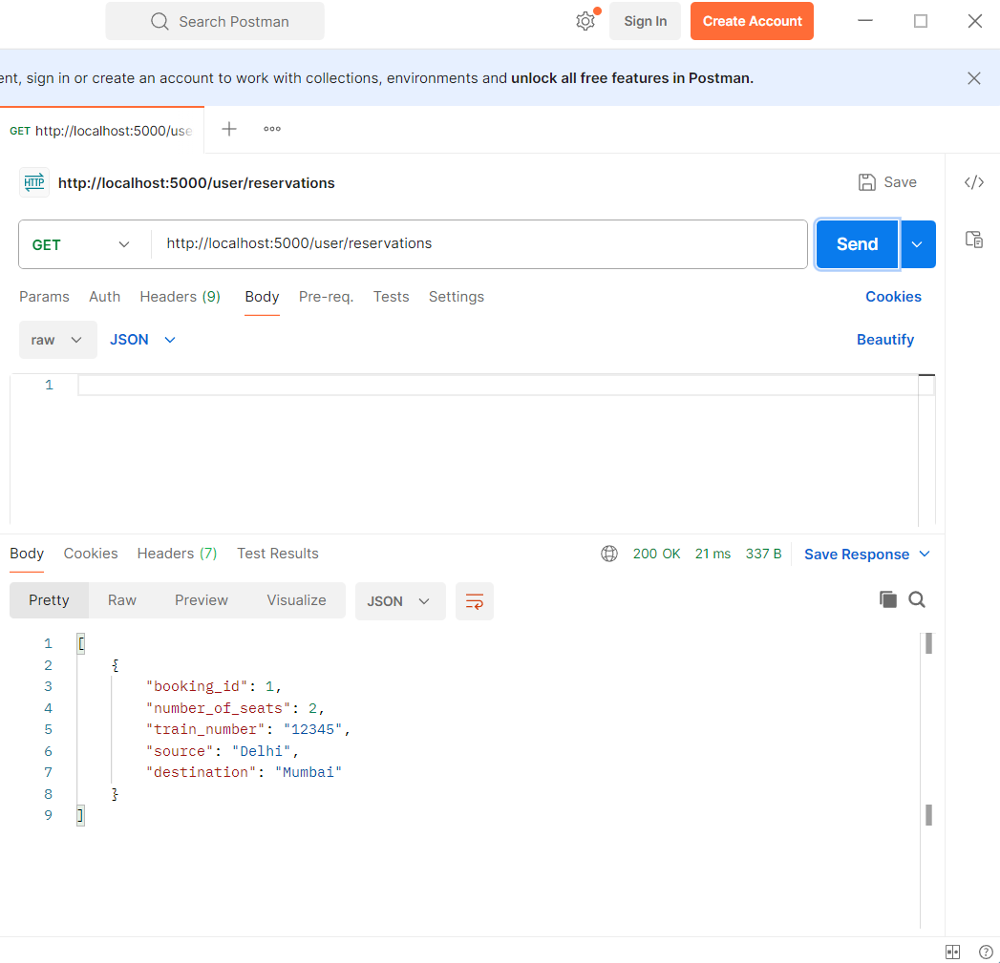
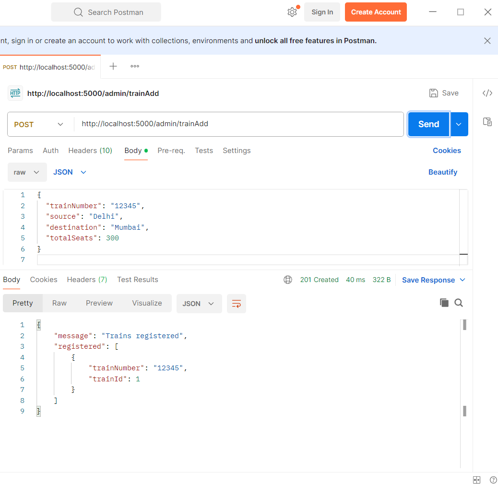
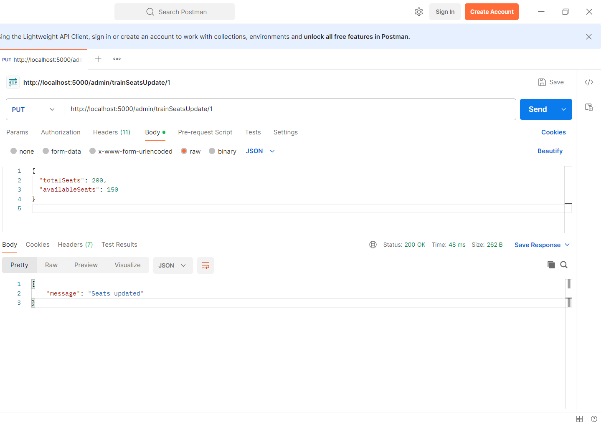

#  IRCTC_API - Railway Management System

The **IRCTC_API** 

- Register and log in
- Book train tickets
- Check train availability
- View bookings
- Admins can add and update trains

The backend is built using **Node.js**, **Express.js**, and **MySQL** for high performance and scalability.

---

##  Project Setup

###  Prerequisites

Ensure you have the following installed:

- Node.js
- MySQL
- Postman (for API testing)

---

###  Environment Variables

Create a `.env` file in your root directory and configure the following variables:

```bash
PORT=5000
DB_HOST=localhost
DB_USER=root
DB_PASSWORD=<your-password>
DB_NAME=irctc_api
JWT_SECRET=<your-jwt-secret>
API_KEY=<your-admin-api-key>
```

---

###  Installation

1. Clone the repository:

```bash
git clone https://github.com/akshatmaheshwari0903/IRCTC-API.git
cd IRCTC-API
```

2. Install dependencies:

```bash
npm install
```

3. Set up your MySQL database with the following schema:

```bash

CREATE DATABASE irctc_api;
USE irctc_api;

CREATE TABLE users (
  id INT AUTO_INCREMENT PRIMARY KEY,
  username VARCHAR(255) NOT NULL,
  email VARCHAR(255) NOT NULL UNIQUE ,
  password VARCHAR(255),
  role ENUM('user', 'admin') DEFAULT 'user',
  created_at TIMESTAMP DEFAULT CURRENT_TIMESTAMP
);

CREATE TABLE trains (
  id INT AUTO_INCREMENT PRIMARY KEY,
  train_number VARCHAR(100) NOT NULL,
  source VARCHAR(100) NOT NULL,
  destination VARCHAR(100) NOT NULL,
  totalSeats INT NOT NULL,
  availableSeats INT NOT NULL,
  created_at TIMESTAMP DEFAULT CURRENT_TIMESTAMP
);

CREATE TABLE bookings (
  id INT AUTO_INCREMENT PRIMARY KEY,
  userId INT NOT NULL,
  trainId INT NOT NULL,
  seatsBooked INT NOT NULL,
  FOREIGN KEY (userId) REFERENCES users(id) ON DELETE CASCADE,
  FOREIGN KEY (trainId) REFERENCES trains(id) ON DELETE CASCADE
);

```
---

###  Starting the Server

``` bash
node index.js
```

Server will run on http://localhost:5000.

---

##  API Endpoints

###  User Routes

#### 1. Register a User  

Registers a new user into the system.  
```bash
- Route: http://localhost:5000/auth/signup 
``` 
- Screenshot:  
  

---

#### 2. Login User  
Authenticates a user and provides a JWT token. 
```bash 
- Route: http://localhost:5000/auth/login  
```
- Screenshot:  
  

---

#### 3. Check Train Availability  
Checks available trains between specified source and destination.  
```bash
- Route: http://localhost:5000/user/check-availability 
``` 
- Screenshot:  
  

---

#### 4. Book Seats  
Books seats on a selected train for an authenticated user.  
```bash
- Route: http://localhost:5000/user/reserve 
```
- Screenshot:  
  

---

#### 5. Get User Bookings  
Retrieves all bookings made by the authenticated user.  
```bash
- Route: http://localhost:5000/user/reservations
```
- Screenshot:  
  

---

###  Admin Routes

#### 6. Add New Train  
Adds a new train to the system (Admin only). 
```bash 
- Route: http://localhost:5000/admin/trainAdd  
```
- Screenshot:  
  

---

#### 7. Update Train Seats  
Updates seat counts for a specific train (Admin only).  
```bash
- Route: http://localhost:5000/admin/trainSeatsUpdate/:trainId
``` 
- Screenshot:  
  


##  Technologies Used

- Node.js – JavaScript runtime for backend
- Express.js – REST API framework
- MySQL – Relational database
- JWT – Secure authentication
- bcrypt – Password hashing
- dotenv – Environment variable management

---

##  Testing the APIs

You can test all routes using Postman by importing the endpoints listed above. Ensure to provide the Authorization and x-api-key headers where required.

---


